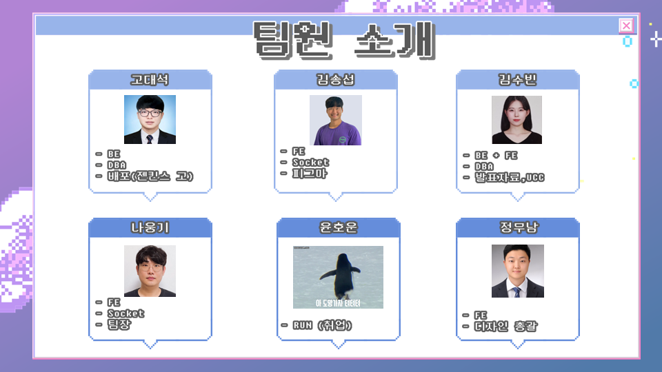
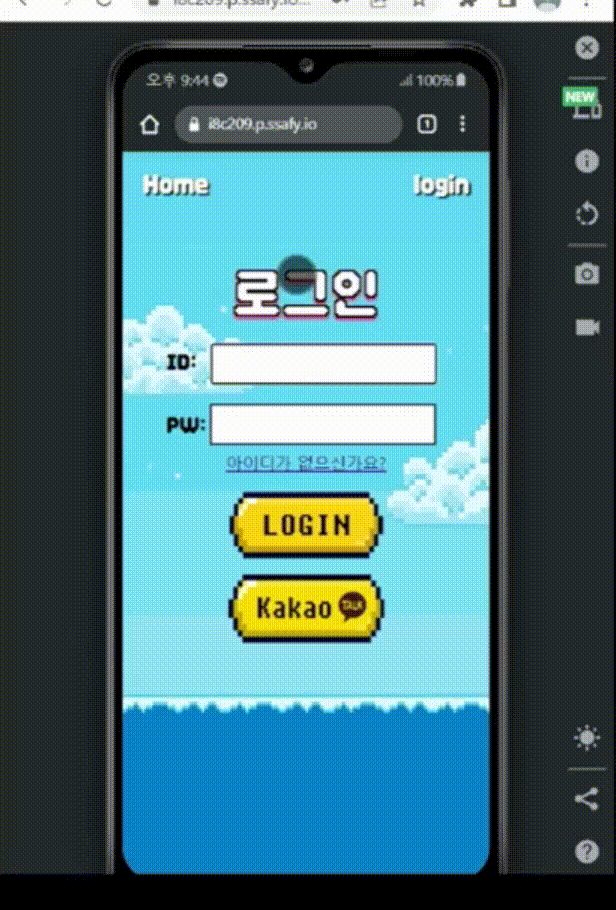
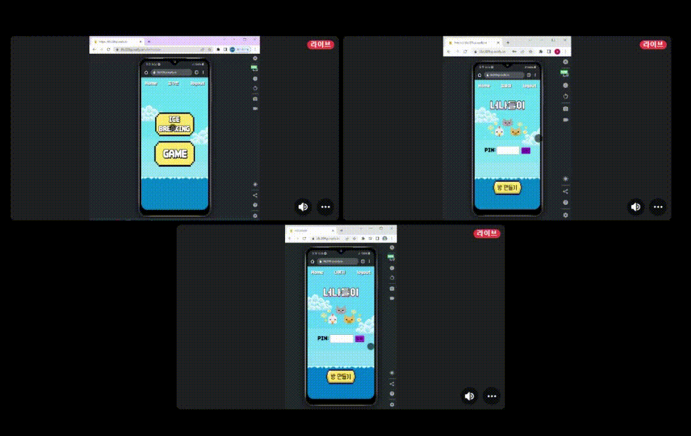
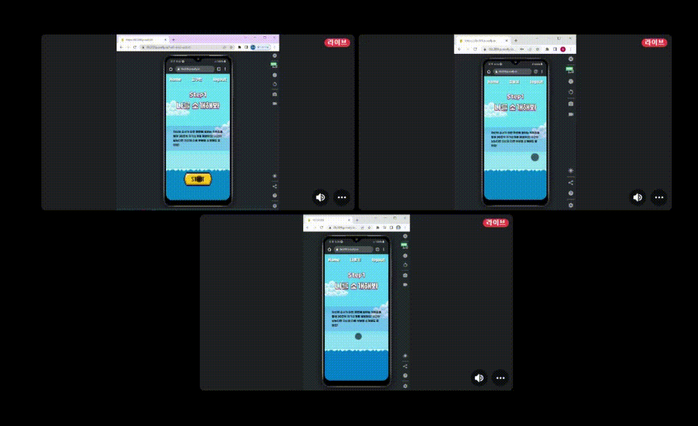
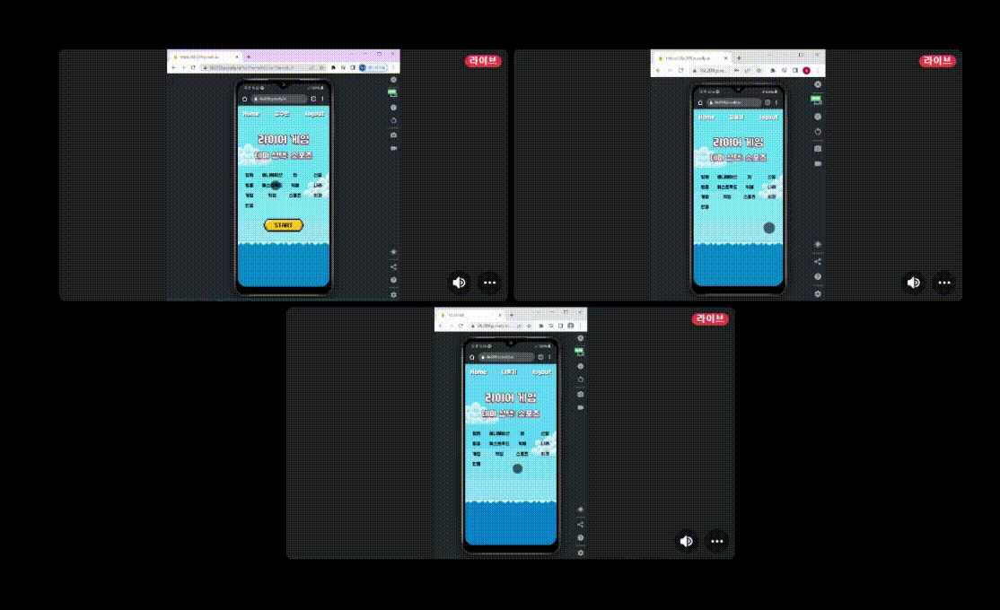
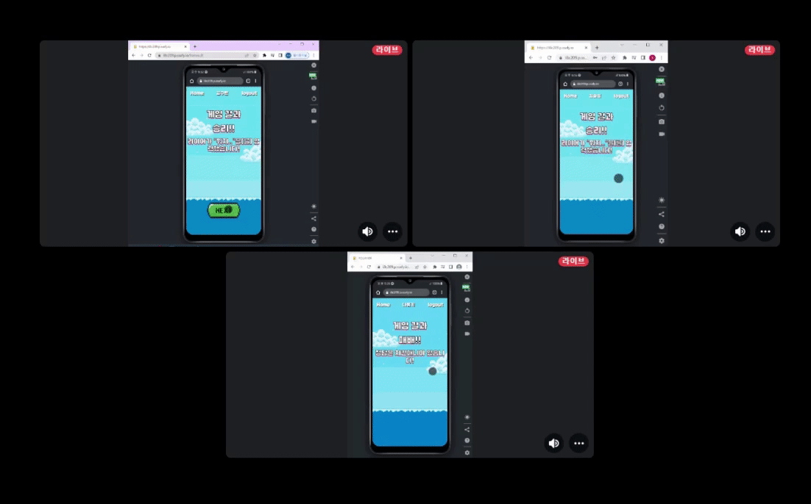

# 🐱 🐶 🐔 너나들이 - ICE BREAKING


#

## 너나들이 링크(모바일 화면)

- [https://i8c209.p.ssafy.io/](https://i8c209.p.ssafy.io/)

#

## 소개 영상

CHECK HERE >>> `/img/nnde.mp4` <<<

#

## 🌊 프로젝트 진행 기간

2023.01.2(월) ~ 2023.02.17(금)
SSAFY 8기 2학기 공통프로젝트 - 너나들이

</br>

## 😄 너나들이 - 개요

- 새로운 만남을 가질 때 분위기를 어떻게 풀지 고민하신 적이 있나요 ?
- 대화 주제에 대해 고민하신 적이 있나요 ?
- 이야기를 어떻게 이어가야할지 고민하신 적이 있나요 ?

##### **‘너나들이’** 는 이러한 어색함을 타파하고자 탄생한 아이스브레이킹 기반 반응형 웹 서비스 입니다.

##### **‘너나들이’** 와 함께라면, 더 이상 이야기를 어떻게 이어가야할지 고민하시지 않아도 됩니다.

</br>

## 😆 주요 기능

---

- ### 아이스브레이킹
  - 새로운 만남을 가질 때 분위기를 어떻게 풀지 고민하신 적이 있나요?
  - 당장 방을 만들어 새로운 사람들과 어색함을 풀어보세요!
  - 퀴즈를 위한 간단한 설문조사 후 4단계로 구성된 아이스브레이킹 모드를 즐겨보세요!
  - step1 : 나를 소개해봐
  - step2 : 나를 찾아봐
  - step3 : 밸런스 게임
  - step4 : 라이어 게임
  - 팀원들과 너나들이를 즐기며 분위기를 따뜻하게 만들어봐요!
    <br/>
- ### 밸런스 게임
  - 고르기 어려운 두 가지의 선택지에 대해서 친구들과 얘기해보아요!
    <br/>
- ### 폭탄돌리기 게임
  - 폭탄을 돌리고 싶은 시간만큼 시간을 맞춰주세요! 벌칙도 미리 정하면 좋겠죠?
  - 째깍째깍! ⏰ 질문을 답하면서 폭탄을 다음 사람에게 패스해요!
  - 펑! 💣 시간이 지날때까지 폭탄을 가지고 있는 사람에게 벌칙 부여!!
    <br/>
- ### 라이어 게임
      - 누군가가 다른 단어를 가지고 있지만 같은 단어를 가지고 있다고 거짓말 하고 있어요!
      - 라이어를 찾아주세요!
      - 단, 라이어에게 단어에 대한 힌트를 너무 주면 안 돼요!
  </br>

## ✔ 주요 기술

---

**Backend - Spring**

- IntelliJ IDEA 2022.3.1 (Ultimate Edition) : 17.0.5+1-b653.23 amd64
- Spring : 5.3.25
- SpringBoot : 2.7.8
- mysql : 8.0.31
- redis : 3.0.504
- Spring Data JPA
- Spring Validation
- Spring Web

**Socket**

- Node.js : 14.21.2
- socket.io : 4.5.4
- express : 4.18.2

**Frontend**

- Visual Studio Code IDE : 1.74.2
- Vue.js : 3.2.47
- Node.js : 14.21.2
- Vuex
- Sock.js-Client
- socket.io : 4.5.4
- vue-socket.io : 3.0.10
- vuex-persistedstate : 4.1.0
- node-sass : 8.0.0
- sass-loader : 13.2.0
- axios : 1.2.6
- email-validator : 2.0.4

**CI/CD**

- AWS EC2 Ubuntu 20.04.5 LTS
- NGINX
- SSL

## ✔ 프로젝트 파일 구조

---

### Back

```
└─com
    └─ssafy
        └─youandi
            ├─config
            │  ├─advice
            │  │  └─exception
            │  ├─jwt
            │  ├─redis
            │  ├─security
            │  └─social
            ├─controller
            │  └─game
            ├─dto
            │  ├─kakao
            │  ├─request
            │  └─response
            ├─entity
            │  ├─game
            │  │  ├─balancegame
            │  │  ├─bombgame
            │  │  ├─liargame
            │  │  └─oxquiz
            │  ├─keyword
            │  ├─mypageinfo
            │  ├─randomnick
            │  ├─redis
            │  └─user
            │      ├─answer
            │      ├─fileinfo
            │      └─survey
            ├─repository
            │  └─game
            └─service
                └─game
```

### Socket

```
├─ node_modules
├─ package.json
└─ server.js
```

### Front

```
└─com
    └─ssafy
        └─youandi
            ├─config
            │  ├─advice
            │  │  └─exception
            │  ├─jwt
            │  ├─redis
            │  ├─security
            │  └─social
            ├─controller
            │  └─game
            ├─dto
            │  ├─kakao
            │  ├─request
            │  └─response
            ├─entity
            │  ├─game
            │  │  ├─balancegame
            │  │  ├─bombgame
            │  │  ├─liargame
            │  │  └─oxquiz
            │  ├─keyword
            │  ├─mypageinfo
            │  ├─randomnick
            │  ├─redis
            │  └─user
            │      ├─answer
            │      ├─fileinfo
            │      └─survey
            ├─repository
            │  └─game
            └─service
                └─game
```

## ✔ 협업 툴

---

- Git
- Notion
- JIRA
- MatterMost
- Webex
- Discord

## ✔ 협업 환경

---

- Gitlab
  - 코드의 버전을 관리
  - 이슈 발행, 해결을 위한 토론
  - MR시, 팀원이 코드리뷰를 진행하고 피드백 게시
- JIRA
  - 매주 목표량을 설정하여 Sprint 진행
  - 업무의 할당량을 정하여 Story Point를 설정하고, In-Progress -> Done 순으로 작업
- 회의
  - Gether Town 아침회의 진행, 전날 목표 달성량과 당일 할 업무 브리핑
  - 각자 위치에서 건네야 할 말이 생기면 팀원의 위치로 이동하여 전달
  - 빠른 소통과 신속한 대응이 가능하다.
- Notion
  - 회의가 있을때마다 회의록을 기록하여 보관
  - 회의가 길어지지 않도록 다음날 제시할 안건을 미리 기록
  - 기술확보 시, 다른 팀원들도 추후 따라할 수 있도록 보기 쉽게 작업 순서대로 정리
  - 컨벤션 정리
  - 간트차트 관리
  - 스토리보드, 시퀀스다이어그램, 기능명세서 등 모두가 공유해야 하는 문서 관리

## ✔ 팀원 역할 분배

---



## 🦒 너나들이 서비스 화면

<hr>

### 회원가입

- 이메일,닉네임,비밀번호를 입력해야합니다.
- 닉네임은 랜덤으로 주어지며 본인이 직접 작성도 가능합니다.
- 이메일과 닉네임은 타 사용자와 중복될 수 없습니다.
- 비밀번호는 숫자와 특수문자를 포함해야 합니다.


<br>

### 로그인

- 이메일과 비밀번호를 입력해야합니다.
- 카카오톡 로그인이 가능합니다.



<br>

### 아이스브레이킹

<br>

#### 인트로

- 메인화면에는 방만들기와 PIN번호로 참여하기 버튼이 있습니다.
- 한명이 방의 인원수를 설정하고 방을 만들면 나머지 참여자들을 PIN을 입력해 방에 참여합니다.
- 방을 만들때 설정한 인원수가 다 접속해야 NEXT버튼이 활성화 됩니다.
- 모두가 모이면 3가지 설문을 작성합니다.(이 설문은 Step2에서 퀴즈로 활용됩니다.)
- 설문을 모두 작성하면 Step1을 시작할 수 있습니다.



<br>

#### Step1. 나를 소개해봐

- 참여자들이 한명씩 돌아가며 30초 동안 자기소개를 합니다.
- 자기소개를 할 때는 랜덤으로 키워드가 주어지고 발표자는 키워드를 통해 자신을 소개합니다.



<br>

#### Step2. 나를 찾아봐

- 인트로에서 작성한 설문을 바탕으로 퀴즈가 나오게 됩니다.
- 참여자들은 퀴즈의 답을 추측하며 서로 대화하고 정답보기 버튼을 눌러 답을 확인합니다.


<br>

#### Step3. 밸런스 게임

- 고르기 힘든 두가지의 선택지를 가지고 대화를 나눕니다.


<br>

#### Step4. 라이어 게임

- 13가지 테마중에서 한 가지를 골라 게임을 시작합니다.
- 참여자중 한명만 라이어가 되어 키워드를 볼 수 없습니다.
- 키워드와 관련된 대화를 하고 누가 라이어인지 추측합니다.
- 투표를 통해 라이어를 선정합니다.
- 라이어가 아닌 참가자가 라이어로 선정되면 라이어가 승리합니다.
- 라이이인 참가자가 라이어로 선정되면 라이어는 키워드를 추측하여 입력합니다.
- 라이어가 키워드를 맞추면 라이어가 승리하고 틀린 경우 라이어가 패배하게 됩니다.



<br>

### 아웃트로

- 참가자들의 닉네임이 일렬로 화면에 표시됩니다.
- 처음 시작부터 끝날 때까지 몇초동안 활동을 했는지 나타납니다.
- 개발자들의 이름이 표시됩니다.



<br>

### 폭탄돌리기

- 게임모드에서는 폭탈돌리기 게임이 추가로 이용 가능합니다.
- 방장은 게임 시간을 설정하고 게임을 시작합니다.
- 화면에 보이는 키워드에 대해 자신의 얘기를 하고 폭탄을 넘깁니다.
- 대답하기 힘든 키워드는 단어바꾸기 버튼을 눌러 변경이 가능합니다.
- 시간이 종료될 때 폭탄을 가지고 있는 사용자가 패배하게 됩니다.


